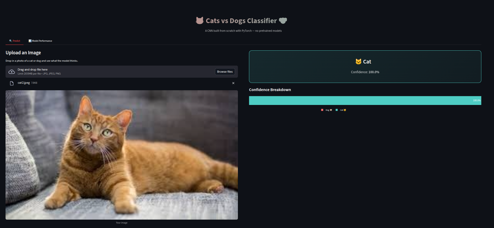

# 🐱 Cats vs Dogs Image Classifier

A CNN built from scratch using PyTorch to classify images of cats and dogs. This was a hands-on project to solidify my understanding of convolutional neural networks, image preprocessing pipelines, and model evaluation — without relying on pretrained models.


<p align="center">
  
</p>

## Overview

The goal here was straightforward: take raw images of cats and dogs, build a convolutional neural network from the ground up, train it, and see how well it generalizes. No transfer learning, no pretrained weights — just a custom architecture to really understand what's happening under the hood.

**What I did:**
- Built a custom CNN with batch normalization and dropout for regularization
- Set up a full preprocessing pipeline with data augmentation (random flips, rotations, color jitter)
- Trained and evaluated the model with proper train/validation/test splits
- Created visualizations to analyze training dynamics and model performance
- Wrapped everything in a Streamlit app for easy demo and interaction

## Project Structure

```
cats-vs-dogs-classifier/
├── notebooks/
│   └── cats_vs_dogs_training.ipynb    # Full training pipeline
├── src/
│   ├── model.py                       # CNN architecture
│   ├── dataset.py                     # Dataset & transforms
│   └── utils.py                       # Helper functions
├── app.py                             # Streamlit demo app
├── requirements.txt
└── README.md
```

## Dataset

I used the [Kaggle Cats vs Dogs dataset](https://www.kaggle.com/c/dogs-vs-cats/data). It has 25,000 labeled images (12,500 each). I split them into:
- **Training:** 80%
- **Validation:** 10%
- **Test:** 10%

> **Note:** The dataset isn't included in this repo due to size. Download it from Kaggle and place the images in a `data/` folder before running the notebook.

## Model Architecture

The CNN has 4 convolutional blocks, each with:
- Conv2d → BatchNorm → ReLU → MaxPool

Followed by a classifier head with dropout for regularization. Input images are resized to 128x128.

| Layer Block | Filters | Output Size |
|-------------|---------|-------------|
| Conv Block 1 | 32 | 64×64 |
| Conv Block 2 | 64 | 32×32 |
| Conv Block 3 | 128 | 16×16 |
| Conv Block 4 | 256 | 8×8 |
| FC Layers | 512 → 1 | Scalar |

## Results

The model reaches **~88-90% accuracy** on the test set after 20 epochs of training. Not state-of-the-art, but pretty solid for a from-scratch CNN.

## Quick Start

### 1. Clone and install dependencies

```bash
git clone https://github.com/yourusername/cats-vs-dogs-classifier.git
cd cats-vs-dogs-classifier
pip install -r requirements.txt
```

### 2. Train the model

Open and run `notebooks/cats_vs_dogs_training.ipynb` in Jupyter. This handles everything from data loading to saving the trained model.

### 3. Launch the Streamlit app

```bash
streamlit run app.py
```

Upload a cat or dog image and see the model's prediction along with training visualizations.

## Key Takeaways

A few things I learned or reinforced during this project:

- **Data augmentation matters a lot** — without it the model overfit quickly on the training set
- **Batch normalization** helped stabilize training and let me use a slightly higher learning rate
- **The gap between train and val loss** is a useful diagnostic — I used it to tune dropout and decide when to stop training
- Building everything from scratch (no pretrained backbone) really forces you to understand each layer's role

## Tech Stack

- **PyTorch** — model building, training loop, data loading
- **torchvision** — image transforms and augmentation
- **Plotly / Seaborn** — training curves, confusion matrix, performance plots
- **Streamlit** — interactive web demo
- **scikit-learn** — evaluation metrics

